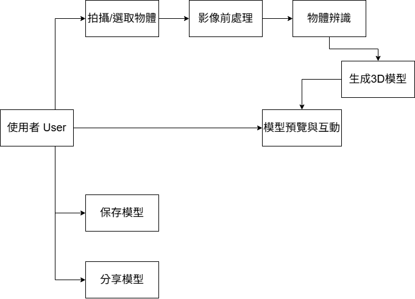

# 物體3D人物模型生成

## 一、功能性需求

### 1.物體辨識模組

 - 系統必須允許使用者上傳圖片進行物體辨識。
 - 系統應自動分析圖片內容，辨識出主要物體類別（例如：水壺、椅子、手機等）。
 - 系統應於辨識完成後，顯示辨識結果及其信心分數（confidence score）。
 - 若系統無法辨識圖片，應提示使用者重新上傳或選擇手動輸入物體名稱。

### 2.擬人化角色生成模組

 - 系統必須根據辨識出的物體種類，自動生成對應的擬人化角色描述。
 - 系統應允許使用者選擇風格選項（如可愛風、未來風、機械風等）。
 - 系統應可透過AI文字生成模型（例如GPT API）產生角色設計描述。
 - 系統應在生成描述前後顯示「處理中」提示，以改善使用者體驗。

### 3.3D建模生成模組

 - 系統必須根據角色描述自動生成對應的3D角色模型。
 - 系統可串接第三方AI建模服務（例如 Meshy.ai 或 TripoSR API）以生成3D檔案。
 - 系統應支援至少一種3D檔案格式（如 .glb 或 .obj）。
 - 若AI建模失敗，系統應回傳錯誤訊息並提示使用者重新嘗試。

### 4.模型展示與互動模組

 - 系統必須提供3D模型的即時預覽功能。
 - 使用者應能旋轉、縮放或平移模型視角。
 - 系統應提供模型下載功能，允許使用者儲存生成的角色。
 - 系統應在模型生成後顯示物體名稱、生成時間與風格類別。

### 5.使用者操作介面模組

 - 系統應提供簡易直覺的介面，讓使用者可依序完成上傳、選擇風格、生成與預覽。
 - 系統應在每個階段提供明確的操作說明與進度提示。
 - 系統應支援中英文介面切換。
 - 系統應保留最近三次生成紀錄，供使用者瀏覽或重新下載。
   
---

## 二、非功能性需求

### 1.性能 (Performance)

 - 系統應在5秒內完成物體辨識。
 - 系統應在30秒內完成3D模型生成與顯示。
 - 系統頁面載入時間應低於3秒。
 - 系統應能同時處理至少20名並發使用者請求。

### 2.安全性 (Security)

 - 使用者上傳的圖片資料僅供模型生成使用，不得對外公開。
 - 系統與外部AI服務之間的資料傳輸應使用HTTPS協議。
 - 系統應具備基本防呆機制，防止惡意或不支援的檔案格式上傳。
 - 若涉及帳號登入，使用者密碼應以SHA-256加密方式儲存。

### 3.可用性 (Usability)

 - 系統介面應支援滑鼠與觸控操作。
 - 系統介面應符合使用者體驗設計原則（UX/UI一致性、按鈕明確）。
 - 系統應在主要瀏覽器（Chrome、Edge、Firefox、Safari）上皆能正常運作。
 - 若生成過程失敗，系統應以視覺提示或彈窗顯示錯誤訊息。

### 4.可擴展性 (Scalability)

 - 系統架構應可擴充以支援更多AI模型（如Point-E或DreamGaussian）。
 - 系統應允許新增更多擬人化風格模板而不需修改主要架構。
 - 系統資料庫設計應能支援未來新增使用者紀錄或模型收藏功能。

### 5.可維護性 (Maintainability)

 - 系統程式碼應採用模組化設計，前後端功能分離。
 - 系統應具備日誌（log）紀錄機制，以便偵錯與追蹤操作紀錄。
 - 所有API連線應集中管理於設定檔中，以利後續修改與維護。
 - 系統文件應清楚說明架構、API介面與執行步驟，方便後續開發者接手。

---

## 功能分解圖

---

## 使用案例圖

---

## 使用案例說明

### 使用案例 1：物體辨識與擬人化建模

| 屬性 | 內容 | 
| :--- | :--- | 
| **使用案例名稱** | **物體辨識與擬人化建模** | 
| **行動者** | **用戶、AI 模型 / 系統** | 
| **說明** | **用戶拍攝或上傳實體物體的圖片，系統利用 AI 模型進行物體辨識，並自動生成該物體的擬人化 3D 模型。** | 
| **完成動作** | **1. 用戶開啟相機或上傳圖片。 2. 系統 進行影像辨識，分析物體類別（例如：水壺、鞋子、椅子）。 3. AI 模型 根據辨識結果自動生成擬人化角色（結合物體特徵與人形設計）。 4. 系統 顯示生成進度與結果預覽。** | 
| **替代方法** | **1. 用戶上傳圖片。 2. 系統 無法正確辨識物體。 3. 系統 提示用戶重新拍攝或選擇手動輸入物體類別。** | 
| **先決條件** | **用戶已授權相機或圖片上傳權限。** | 
| **後置條件** | **成功生成可供預覽或編輯的擬人化模型。** | 
| **假設** | **AI 模型具備物體分類與 3D 擬人化生成能力。** | 

### 使用案例 2：模型預覽與互動

| 屬性 | 內容 | 
| :--- | :--- | 
| **使用案例名稱** | **模型預覽與互動** | 
| **行動者** | **用戶** | 
| **說明** | **用戶可以即時預覽生成的 3D 擬人化模型，並進行旋轉、縮放、改變姿勢或表情的互動操作。** | 
| **完成動作** | **1. 系統 顯示 3D 模型於預覽介面中。 2. 用戶 拖曳滑鼠或使用手勢進行旋轉與縮放。 3. 用戶 點選功能按鈕改變模型表情或姿勢。 4. 系統 即時更新並渲染互動效果。** | 
| **替代方法** | **1. 系統 在裝置效能不足時自動切換為低解析度預覽模式。** | 
| **先決條件** | **系統已成功生成模型並載入至預覽模組。** | 
| **後置條件** | **用戶完成模型檢視與互動設定。** | 
| **假設** | **系統支援 WebGL 或等效的 3D 繪圖技術。** | 

### 使用案例 3：模型分享與儲存

| 屬性 | 內容 | 
| :--- | :--- | 
| **使用案例名稱** | **模型分享與儲存** | 
| **行動者** | **用戶、系統** | 
| **說明** | **用戶可以將生成的 3D 擬人化模型儲存在個人帳號內，或分享到社群平台。** | 
| **完成動作** | **1. 用戶 點擊「儲存/分享」。 2. 系統 將模型檔案與相關屬性（名稱、標籤、生成日期）儲存在資料庫中。 3. 用戶 選擇社群平台進行分享（例如 IG、X、Discord）。 4. 系統 生成可視化截圖或連結並發布。** | 
| **替代方法** | **1. 網路不穩導致分享失敗，系統 提示用戶稍後再試或改為本地儲存。** | 
| **先決條件** | **用戶已登入帳號並授權相關存取權限。** | 
| **後置條件** | **模型已儲存至雲端或成功分享到指定平台。** | 
| **假設** | **系統支援雲端資料儲存與社群 API 串接。** | 
