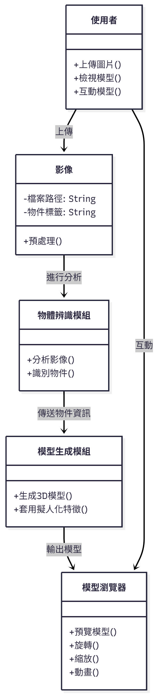
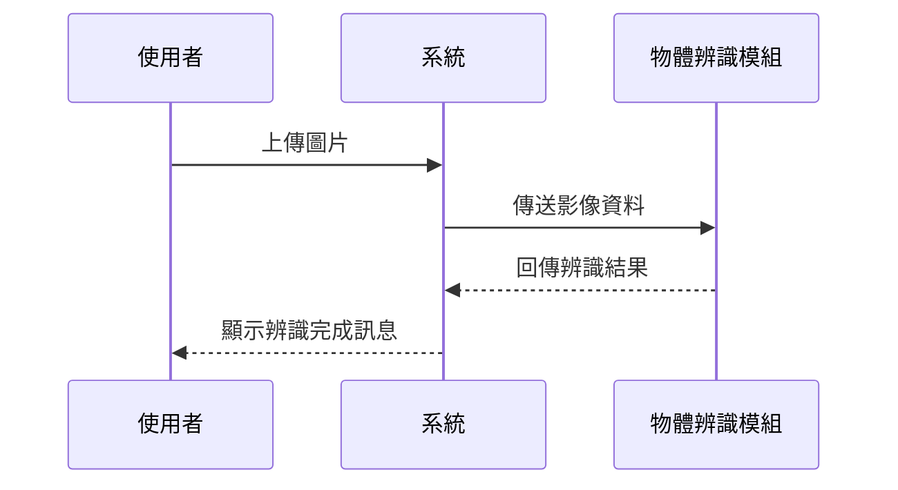
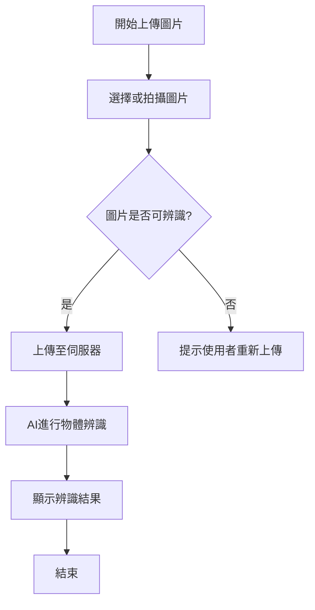
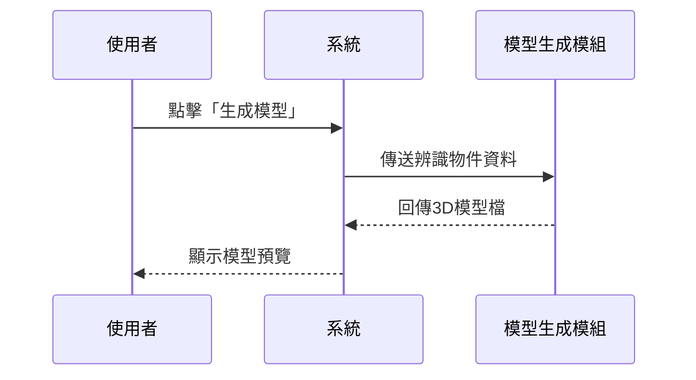
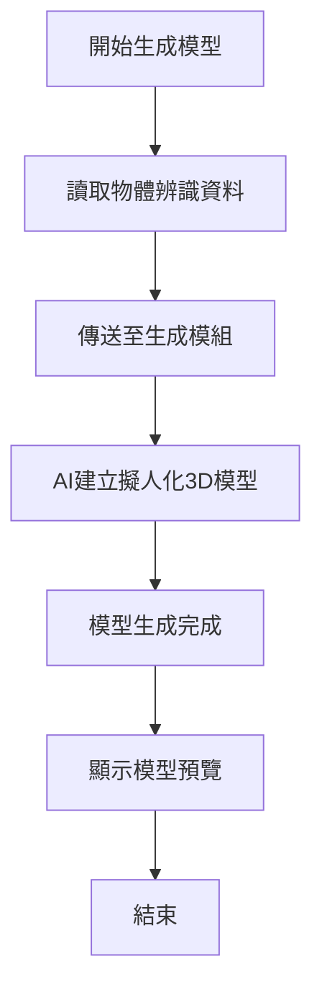
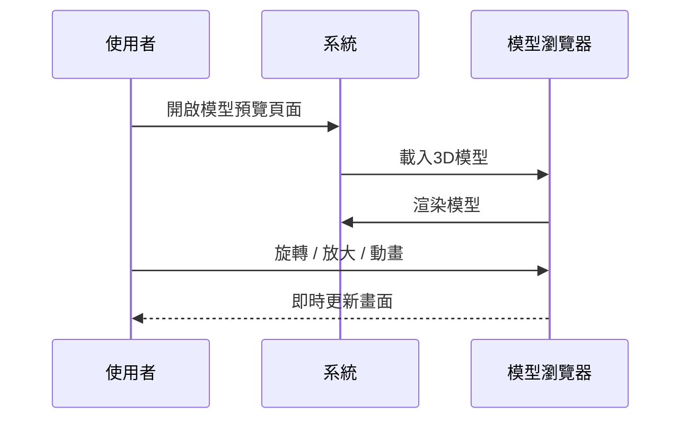
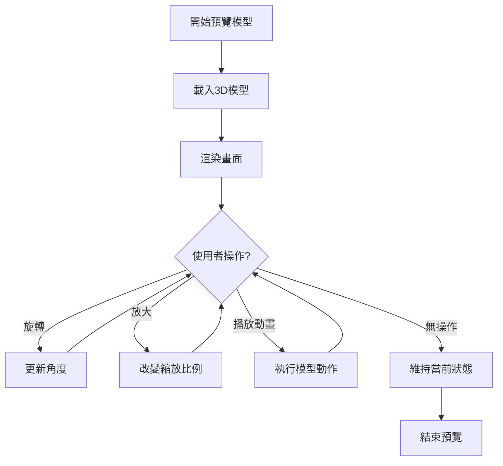

### UML類別圖

---
### 使用案例一：物體辨識與上傳 
### - 循序圖

```mermaid 
sequenceDiagram
    participant User as 使用者
    participant System as 系統
    participant Recognizer as 物體辨識模組

    User->>System: 上傳圖片
    System->>Recognizer: 傳送影像資料
    Recognizer-->>System: 回傳辨識結果
    System-->>User: 顯示辨識完成訊息
```

### - 活動圖

```mermaid
%% 使用案例一：物體辨識與上傳 - 活動圖
flowchart TD
    A[開始上傳圖片] --> B[選擇或拍攝圖片]
    B --> C{圖片是否可辨識?}
    C -->|是| D[上傳至伺服器]
    D --> E[AI進行物體辨識]
    E --> F[顯示辨識結果]
    C -->|否| G[提示使用者重新上傳]
    F --> H[結束]
```

---
### 使用案例二：生成3D模型 
### - 循序圖

```mermaid
sequenceDiagram
    participant User as 使用者
    participant System as 系統
    participant Generator as 模型生成模組

    User->>System: 點擊「生成模型」
    System->>Generator: 傳送辨識物件資料
    Generator-->>System: 回傳3D模型檔
    System-->>User: 顯示模型預覽
```

### - 活動圖

```mermaid
flowchart TD
    A[開始生成模型] --> B[讀取物體辨識資料]
    B --> C[傳送至生成模組]
    C --> D[AI建立擬人化3D模型]
    D --> E[模型生成完成]
    E --> F[顯示模型預覽]
    F --> G[結束]
```

---
### 使用案例三：模型預覽與互動
### - 循序圖

```mermaid
sequenceDiagram
    participant User as 使用者
    participant System as 系統
    participant Viewer as 模型瀏覽器

    User->>System: 開啟模型預覽頁面
    System->>Viewer: 載入3D模型
    Viewer->>System: 渲染模型
    User->>Viewer: 旋轉 / 放大 / 動畫
    Viewer-->>User: 即時更新畫面
```

### - 活動圖

```mermaid
%% 使用案例三：模型預覽與互動 - 活動圖
flowchart TD
    A[開始預覽模型] --> B[載入3D模型]
    B --> C[渲染畫面]
    C --> D{使用者操作?}
    D -->|旋轉| E[更新角度]
    D -->|放大| F[改變縮放比例]
    D -->|播放動畫| G[執行模型動作]
    D -->|無操作| H[維持當前狀態]
    E --> D
    F --> D
    G --> D
    H --> I[結束預覽]
```
