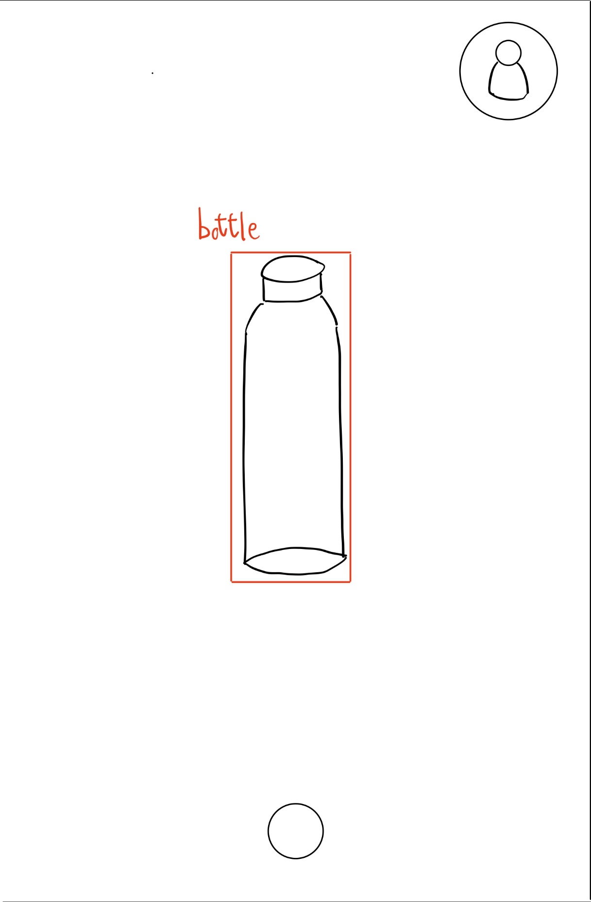
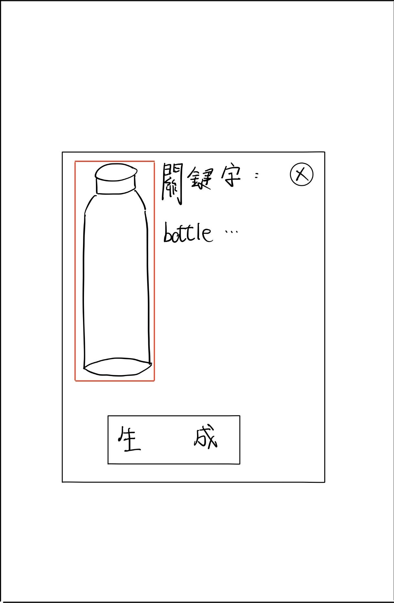
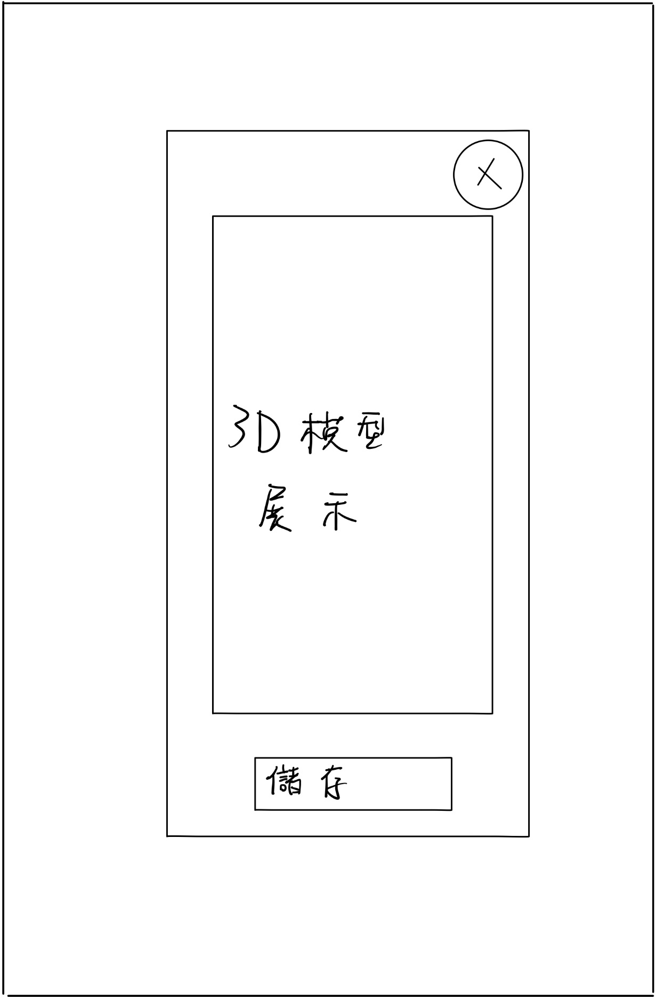
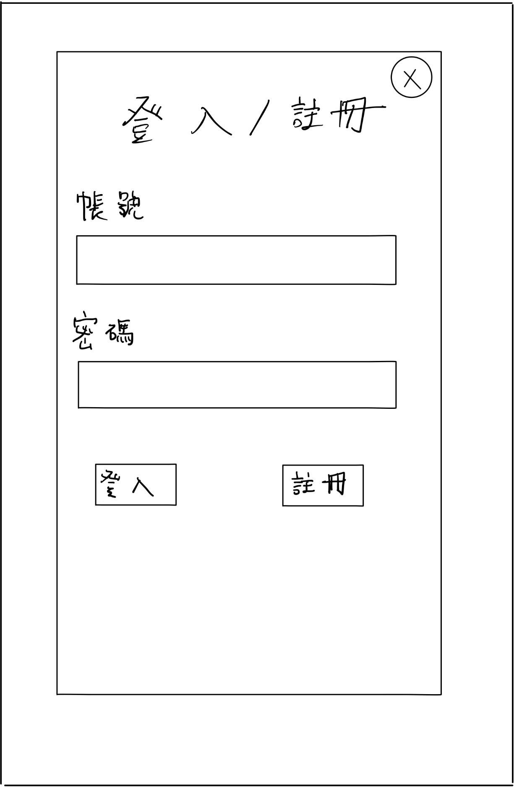

# 介面設計分鏡板

### 物體辨識掃描

| 元件名稱 | 元件功能 |
| :--- | :--- |
| **鎖定按鈕** | 鎖定辨識到的物體做轉換 |
| **個人頁面按鈕(右上角小人)** | 進到帳號登入系統 |

---
### 參數設定

| 欄位名稱 | 資料型態 | 驗證規則 |
| :--- | :--- | :--- | 
| **關鍵字** |  String | 1. 非必填  |

| 元件名稱 | 元件功能 |
| :--- | :--- |
| **關閉按鈕** | 關閉此頁面 |
| **生成按鈕** | 根據辨識物體的圖片及關鍵字進行生成模型 |

---

### 3D模型展示

| 元件名稱 | 元件功能 |
| :--- | :--- |
| **關閉按鈕** | 關閉此頁面 |
| **儲存按鈕** | 將此模型儲存至個人3D模型庫 |

---

### 登入系統

| 欄位名稱 | 資料型態| 驗證規則 |
| :--- | :--- | :--- | 
| **帳號** |  String | 1. 必填  2. 不可為空 |
| **密碼** |  String  |  1. 必填  2. 不可為空 |

| 元件名稱 | 元件功能 |
| :--- | :--- |
| **關閉按鈕** | 關閉此頁面 |
| **登入按鈕** | 驗證帳密進行登入 |
| **註冊按鈕** | 註冊帳號 |

---

## 個人頁面

| 元件名稱 | 元件功能 |
| :--- | :--- |
| **關閉按鈕** | 關閉此頁面 |
| **登出按鈕** | 登出帳號 |
| **模型展示** | 點擊展示模型 |

---
