## (1) 任務分配

| 學號 | 姓名 | 負責任務 | 
| :--- | :--- | :--- | 
| **C111118147** | **李致穎** | **後端** | |
| **C112118119** | **王怡智** | **前端** | |
---

## (2) 📊 甘特圖

```mermaid
gantt
    title 開發任務總覽
    dateFormat  YYYY-MM-DD
    excludes    weekends

    section 規劃階段
    確認主題              :a1, 2025-10-01, 2d
    任務分配              :a2, after a1, 4d
    API 工具選擇          :a3, after a1, 4d

    section 開發準備階段
    建立 App 專案框架     :a4, after a2, 10d
    整合相機功能          :a5, after a4, 8d
    整合 API              :a6, after a4, 7d

    section 3D 模型處理階段
    建立 3D 模型預覽介面      :a7, after a5, 15d
    整合 3D Viewer           :a8, after a7, 5d
    儲存/下載/分享模型功能    :a9, after a8, 5d

    section 測試階段
    功能測試                :a10, after a9, 3d
    修復 Bug 與優化          :a11, after a10, 5d

```

---
## (3) 📈 PERT / CPM 圖

```mermaid
flowchart TD

A1[1 確認主題<br>2天] --> A2[2 任務分配<br>4天]
A1 --> A3[3 API 工具選擇<br>4天]
A2 --> A4[4 建立 App 專案框架<br>10天]
A4 --> A5[5 整合相機功能 <br>8天]
A4 --> A6[5 API整合 <br>8天]
A3 --> A6
A5 --> A7
A6 --> A7[7 建立 3D 模型預覽介面<br>15天]
A7 --> A8[8 整合 3D Viewer<br>5天]
A8 --> A9[9 儲存/下載/分享模型功能<br>5天]
A9 --> A10[10 功能測試<br>3天]
A10 --> A11[11 修復 Bug 與優化<br>5天]
```

---
