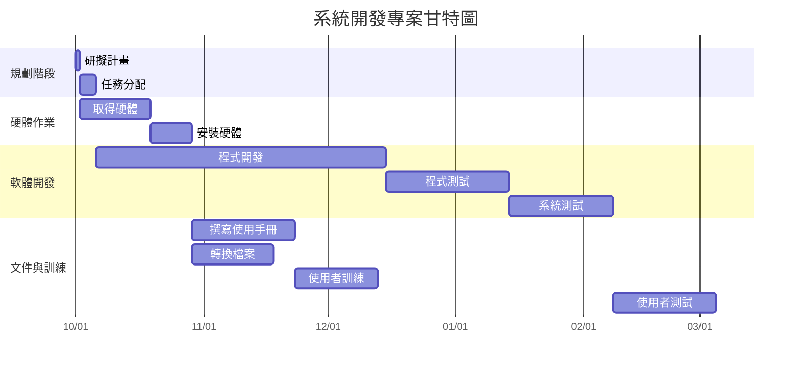

## (2) 📊 甘特圖

```mermaid
gantt
    title 系統開發專案甘特圖
    dateFormat  YYYY-MM-DD
    axisFormat  %m/%d

    section 規劃階段
    研擬計畫          :a1, 2025-10-01, 1d
    任務分配          :a2, after a1, 4d

    section 硬體作業
    取得硬體          :a3, after a1, 17d
    安裝硬體          :a5, after a3, 10d

    section 軟體開發
    程式開發          :a4, after a2, 70d
    程式測試          :a6, after a4, 30d
    系統測試          :a9, after a6, 25d

    section 文件與訓練
    撰寫使用手冊      :a7, after a5, 25d
    轉換檔案          :a8, after a5, 20d
    使用者訓練        :a10, after a7 a8, 20d
    使用者測試        :a11, after a9 a10, 25d
```

---
