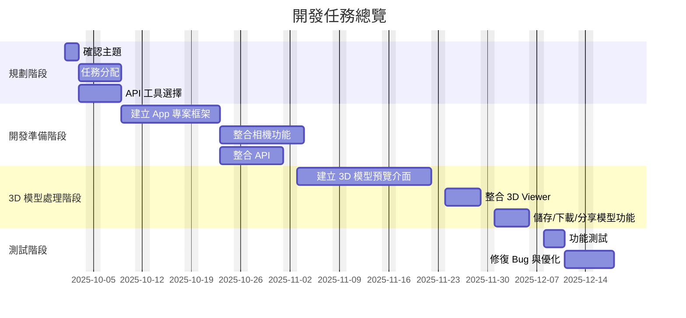

# 物體3D人物模型生成

## 1.1 研究背景與動機

在網路上看到3d手辦生成器覺得很有趣，想開發一個能夠生成3d人物然後以ar呈現互動的軟體。

## 1.2 研究目的

- **目標一**：將照片辨識到的物體轉換成3d模型。  
- **目標二**：將3d模型以ar呈現在手機上。
- 
## 1.3 研究範圍

### 研究範圍：

- **功能範圍**：辨識圖片中物體，轉換3d模型，ar輸出。

- **技術範圍**：ar,ai物體辨識,物體生成。
---

# 第二章 專題時程規劃與分工

## 2.1 工作項目

### 系統開發（Development）

-  建立 App 專案框架
-  整合相機功能
-  整合 API
-  建立 3D 模型預覽介面
-  整合 3D Viewer
-  儲存/下載/分享模型功能
-  測試/修復/優化
## 2.2 甘特圖（Gantt Chart）

---

